# devops-final-project

# DevOps Final Project

This repository contains a complete end-to-end DevOps project demonstrating:

- Terraform Infrastructure as Code
- Ansible Configuration Management
- Docker Containerization
- GitHub Actions CI/CD
- AWS Deployment

## Project Structure

#PHASE 1 — Prepare GitHub Repository


https://github.com/anslemdevops/devops-final-project


Create this folder structure locally:


devops-final-project/
│
├── apps/
├── terraform/
├── ansible/
├── screenshots/
├── .github/
│   └── workflows/
└── README.md


# PHASE 2:

PHASE 2 — Create EC2 Instance
Step 1: Launch EC2

AWS Console → EC2 → Launch Instance

Use:

Name: devops-final-project-server
AMI: Amazon Linux 2023
Instance Type: t2.micro
Key Pair: Your existing key pair
Security Group

Allow:

SSH     22      My IP
HTTP    80      Anywhere
Custom  5000    Anywhere
Custom  8080    Anywhere

Launch the instance.


# TASK 3

Connect via SSH

## Phase 1: AWS EC2 Provisioning

### Objective

Provision a cloud server to host the portfolio and Java applications.

### EC2 Configuration

| Setting       | Value                       |
| ------------- | --------------------------- |
| Name          | devops-final-project-server |
| OS            | Amazon Linux 2023           |
| Instance Type | t2.micro                    |

### Security Group

* SSH (22)
* HTTP (80)
* Portfolio App (5000)
* Java App (8080)


#### EC2 Instance Running


#### SSH Connection


SSH connected

# PHASE 2 - install Docker on EC2

## Phase 2: Docker Installation

### Objective

Install Docker on the EC2 instance to host containerized applications.

### Commands Used

```bash
sudo dnf update -y
sudo dnf install docker -y
sudo systemctl start docker
sudo systemctl enable docker
sudo usermod -aG docker ec2-user
newgrp docker
docker ps
```

### Verification

Docker was successfully installed and the Docker service was running.


#### Docker Installed


#### Docker Service Running


#### Docker Verification


 


# Flask Portfolio Application

## Objective

Replace the plain text Flask response with a professional HTML portfolio page using Flask templates.

## Step 1: Create the HTML Template

Created a template file:


templates/index.html


Added the following HTML content:

```html
<!DOCTYPE html>
<html>
<head>
    <title>Anslem Iwebor Portfolio</title>
</head>
<body>
    <h1>Welcome to Anslem Iwebor's Portfolio</h1>
    <p>Junior Cloud & DevOps Engineer</p>

    <h2>Skills</h2>
    <ul>
        <li>AWS</li>
        <li>Docker</li>
        <li>Terraform</li>
        <li>Ansible</li>
        <li>GitHub Actions</li>
    </ul>
</body>
</html>
```

## Step 2: Update Flask Application

Modified `app.py` to render the HTML template.

```python
from flask import Flask, render_template

app = Flask(__name__)

@app.route('/')
def home():
    return render_template('index.html')

if __name__ == '__main__':
    app.run(host='0.0.0.0', port=5000)
```

## Step 3: Run the Application

Started the Flask application:


python app.py


Application output:


* Running on all addresses (0.0.0.0)
* Running on http://127.0.0.1:5000


## Step 4: Verify the Application

Opened the application in a browser:


http://localhost:5000


The portfolio page was displayed successfully.


## Installing Git on the EC2 Instance

Git was installed on the Amazon Linux 2023 EC2 instance to enable cloning and managing the project repository directly on the server.

### Install Git


sudo dnf install git -y


### Verify Installation


git --version


### Output

git version <your-version>
```


![alt text] (screenshots/06.git-installed-ec2.png)


## Cloning the GitHub Repository

The project repository was cloned from GitHub onto the EC2 instance.

### Clone Repository


git clone https://github.com/anslemdevops/devops-final-project.git


### Verify Repository

ls


### Screenshot


# Pushing Changes to GitHub

# Docker Compose Deployment 

## Overview

After creating Docker images for both the Flask Portfolio application and the Java web application, Docker Compose was used to deploy and manage the applications on an Amazon EC2 instance.

The deployment process included:

* Building the Docker images
* Creating and starting containers
* Verifying container health
* Testing application accessibility through a web browser

---

## Building the Applications

The existing containers were stopped and removed before rebuilding the images because there was an error.

### Command


docker compose down
docker compose build --no-cache


### Build Output

The build process successfully created Docker images for both applications.

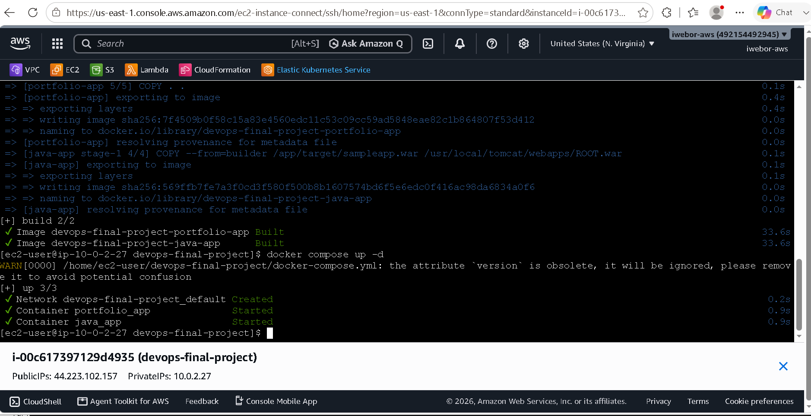


## Starting the Containers

Docker Compose was used to create and start the containers in detached mode.

### Command


docker compose up -d


### Result

* Docker network created successfully
* Portfolio application container started
* Java application container started

**Screenshot**


---

## Verifying Running Containers

After deployment, the running containers were verified using Docker.

### Command


docker ps


### Result

Two containers were running successfully:

| Container     | Purpose                     | Port |
| ------------- | --------------------------- | ---- |
| portfolio_app | Flask Portfolio Application | 5000 |
| java_app      | Java Web Application        | 8080 |

**Screenshot**

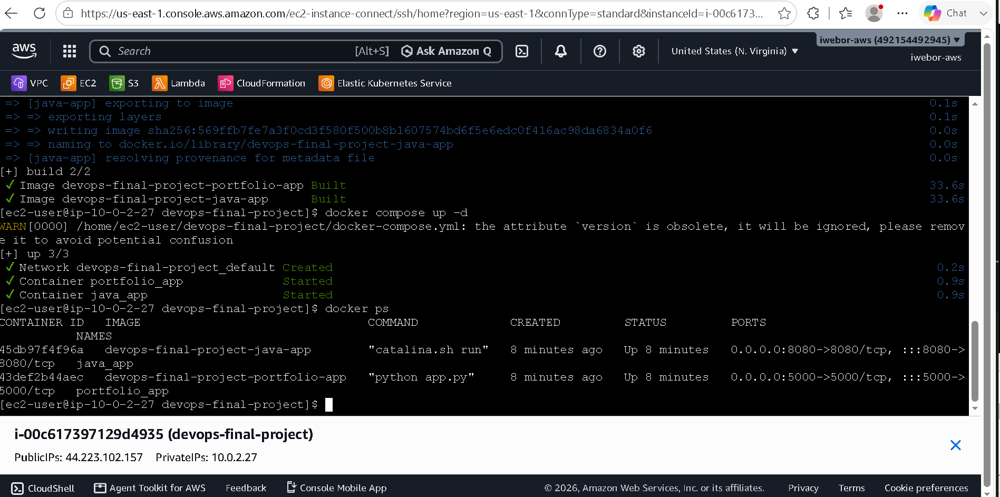


## Testing the Portfolio Application

The Flask Portfolio application was accessed through the EC2 public IP address.

### URL


http://<44.223.102.157 >:5000


### Verification

The application loaded successfully in the browser, confirming that:

* The Flask application was running correctly
* Docker port mapping was working
* Security group rules allowed inbound traffic

**Screenshot**

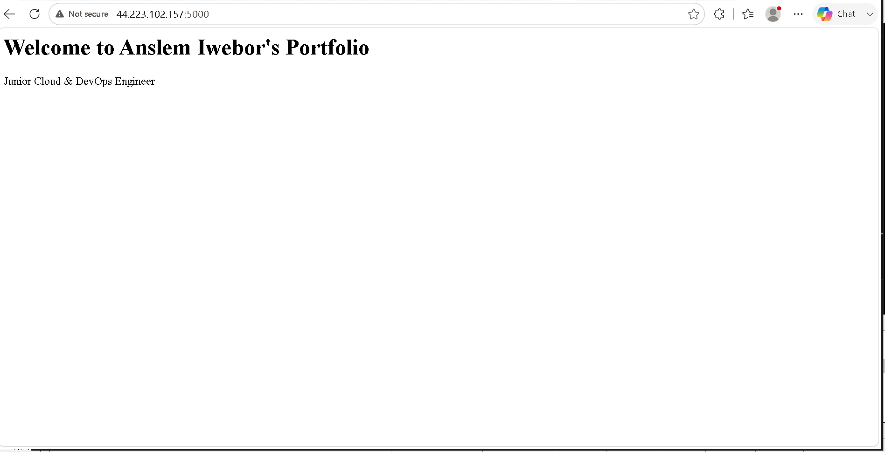


## Testing the Java Application

The Java application was accessed through the EC2 public IP address.

### URL


http://<44.223.102.157 >:8080


### Verification

The application loaded successfully in the browser, confirming that:

* Tomcat was running correctly
* The application was deployed successfully
* Docker networking and port forwarding were functioning properly

**Screenshot**

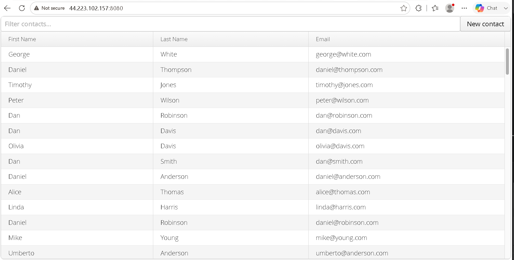


## Deployment Summary

The deployment was completed successfully using Docker Compose on an Amazon EC2 instance.

### Successfully Verified

* Docker images built successfully
* Containers created and started successfully
* Docker networking configured correctly
* Flask Portfolio Application accessible on port 5000
* Java Application accessible on port 8080
* Browser accessibility verified for both applications

This deployment demonstrates the use of containerization and orchestration tools to manage multiple applications in a consistent and repeatable manner.


# Terraform

    # 🚀 Infrastructure Provisioning with Terraform

## Overview

As part of the DevOps Modern End-to-End Deployment project, Terraform was used to provision AWS infrastructure using Infrastructure as Code (IaC). This approach ensures that infrastructure can be created, modified, and managed consistently through version-controlled configuration files.

The infrastructure was deployed in AWS US East (N. Virginia) Region (`us-east-1`).

---

## Terraform Project Structure

```text
terraform/
├── provider.tf
├── main.tf
├── variables.tf
├── outputs.tf
└── terraform.tfvars
```

### File Description

| File | Purpose |
|--------|---------|
| provider.tf | Configures the AWS provider |
| variables.tf | Defines reusable Terraform variables |
| terraform.tfvars | Stores variable values |
| main.tf | Contains infrastructure resource definitions |
| outputs.tf | Displays useful deployment outputs |

---

## Infrastructure Created

Terraform provisioned the following AWS resources:

### Virtual Private Cloud (VPC)

A dedicated VPC was created to provide network isolation for project resources.

**Configuration**

- CIDR Block: `10.0.0.0/16`
- DNS Hostnames Enabled
- DNS Resolution Enabled

### Public Subnet

A public subnet was created to host internet-facing resources.

**Configuration**

- CIDR Block: `10.0.1.0/24`
- Availability Zone: `us-east-1a`
- Auto-assign Public IP: Enabled

### Internet Gateway

An Internet Gateway was attached to the VPC to allow communication with the public internet.

### Route Table

A public route table was configured with:

| Destination | Target |
|------------|---------|
| 0.0.0.0/0 | Internet Gateway |

### Security Group

A security group was created to allow access to the deployed applications.

#### Inbound Rules

| Port | Protocol | Purpose |
|--------|----------|----------|
| 22 | TCP | SSH Access |
| 80 | TCP | HTTP Traffic |
| 5000 | TCP | Flask Portfolio Application |
| 8080 | TCP | Java Application |

#### Outbound Rules

| Port | Protocol | Destination |
|--------|----------|------------|
| All | All | 0.0.0.0/0 |

### EC2 Instance

A Linux EC2 instance was provisioned to host the applications.

| Property | Value |
|-----------|---------|
| Instance Type | t3.micro |
| Region | us-east-1 |
| Key Pair | anslem-keypair |

---

## Terraform Workflow

### Initialize Terraform

```bash
terraform init
```

Downloads and installs required providers.

### Validate Configuration

```bash
terraform validate
```

Checks configuration syntax and structure.

### Review Execution Plan

```bash
terraform plan
```

Displays resources that Terraform intends to create.

### Apply Infrastructure

```bash
terraform apply
```

Creates AWS resources defined in the configuration files.

---

## Deployment Output

Terraform successfully created the infrastructure and returned the following outputs:

```text
instance_id = i-06f5d59b6701f3887
instance_public_ip = 100.60.80.25
```

---ssh -i ~/.ssh/anslem-keypair.pem ec2-user@100.60.80.25

## Screenshots

### Terraform Configuration Files


### Terraform Validation


### Terraform Plan


### Terraform Apply Success


### EC2 Instance Created


### VPC Created


### Security Group Configuration


---

## Challenges Encountered and Resolution

### Key Pair Error

**Issue**

```text
InvalidKeyPair.NotFound
```

**Cause**

Terraform referenced an incorrect key pair name.

**Resolution**

Updated:

```hcl
key_name = "anslem-keypair"
```

---

### Availability Zone Constraint

**Issue**

```text
Unsupported: Your requested instance type (t3.micro) is not supported in us-east-1e
```

**Cause**

The selected Availability Zone did not support the requested instance type.

**Resolution**

The subnet was recreated in:

```text
us-east-1a
```

and deployment completed successfully.

---

## Benefits of Using Terraform

- Infrastructure managed as code
- Version-controlled deployments
- Consistent and repeatable provisioning
- Reduced manual AWS configuration
- Faster deployment and recovery processes

Terraform enabled automated provisioning of the complete AWS infrastructure required for hosting and managing the project applications.


# Next Phase: Ansible


Configuration Management with Ansible
Overview

Ansible was used as the configuration management tool to automate the setup and configuration of the AWS EC2 instance provisioned through Terraform.

The objective was to eliminate manual server configuration and ensure that infrastructure could be configured consistently and repeatedly using Infrastructure as Code (IaC) principles.

Ansible Architecture

The Ansible control node was installed on the local Ubuntu WSL environment and connected securely to the target AWS EC2 instance using SSH key authentication.


Local Machine (WSL Ubuntu)
        |
        | SSH
        |
        v
AWS EC2 Instance
        |
        +-- Install Git
        +-- Install Docker
        +-- Start Docker Service
        +-- Enable Docker on Boot


# Ansible Project Structure

ansible/
├── ansible.cfg
├── inventory
└── playbook.yml


ansible.cfg

Used to define Ansible configuration settings.


[defaults]
inventory = inventory
host_key_checking = False


inventory

Defines the target EC2 instance and SSH connection details.

[web]
100.60.80.25 ansible_user=ec2-user ansible_ssh_private_key_file=/home/anslem/.ssh/anslem-keypair.pem


playbook.yml

Contains the automation tasks executed on the EC2 instance.


---
- name: Configure DevOps Server
  hosts: web
  become: yes

  tasks:

    - name: Update packages
      yum:
        name: "*"
        state: latest

    - name: Install Git
      yum:
        name: git
        state: present

    - name: Install Docker
      yum:
        name: docker
        state: present

    - name: Start Docker
      service:
        name: docker
        state: started
        enabled: yes


Verifying Connectivity

Before executing the playbook, connectivity between the Ansible control node and the EC2 instance was verified using the Ansible Ping module.

Command


ansible web -i inventory -m ping

Output

100.60.80.25 | SUCCESS => {
    "changed": false,
    "ping": "pong"
}


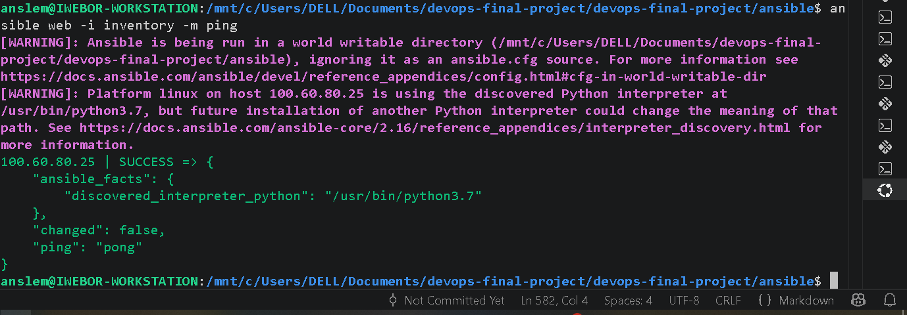


Executing the Playbook

The playbook was executed to automate server configuration.

Command

ansible-playbook -i inventory playbook.yml


Tasks Performed
Updated operating system packages
Installed Git
Installed Docker Engine
Started Docker service
Enabled Docker service at boot


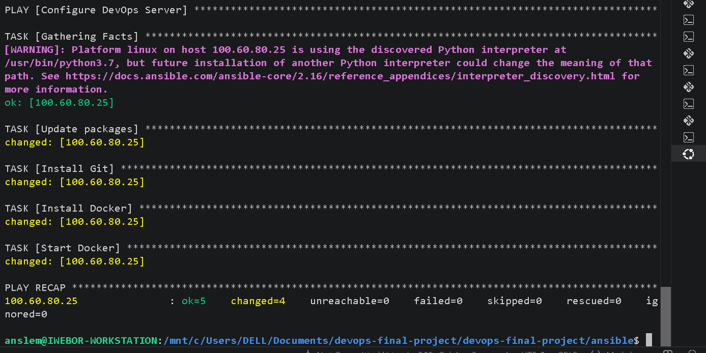


Validation

After the playbook execution, the EC2 instance was validated to confirm successful installation and configuration.

Verify Docker

docker --version

Output

Docker version 25.0.14

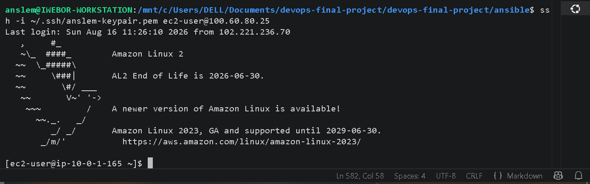


Verify Git

git --version


Output

git version 2.47.3

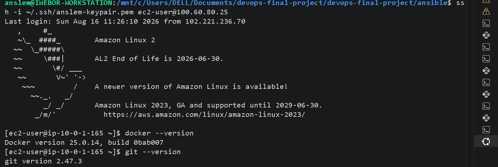


Verify Docker Service

sudo systemctl status docker

Output

Active: active (running)


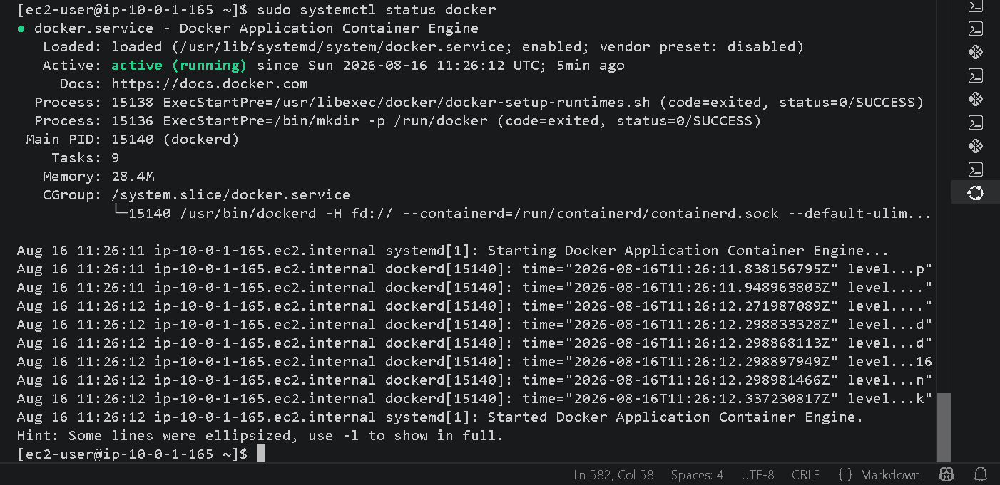


Benefits of Using Ansible
Automated server configuration
Reduced manual administrative effort
Consistent and repeatable deployments
Agentless architecture using SSH
Infrastructure managed as code
Faster provisioning of application servers
Outcome

The AWS EC2 instance was successfully configured using Ansible automation. Required dependencies were installed, Docker was configured and started automatically, and the server was prepared to host the containerized Portfolio and Java applications.


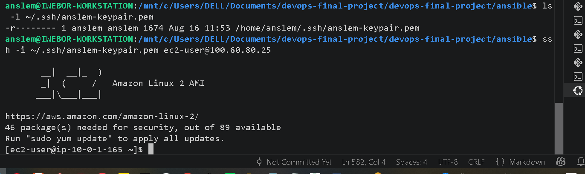


## SSH Connectivity Verification

Before running Ansible, SSH access to the target EC2 instance was verified.


# Part 2: CI/CD Pipeline Implementation Using GitHub Actions


# CI/CD Pipeline with GitHub Actions

## Objective

The objective of this phase was to automate the Continuous Integration (CI) process using GitHub Actions. The pipeline automatically validates and tests the project whenever code is pushed to the GitHub repository.

---

## GitHub Actions Workflow Structure

A GitHub Actions workflow was created inside the following directory:


.github/
└── workflows/
    └── deploy.yml


### Screenshot


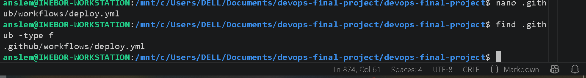

---

## Workflow Configuration

The workflow was configured to:

* Trigger automatically on every push to the `main` branch
* Check out the repository source code
* Set up the required runtime environment
* Validate project files
* Execute CI pipeline stages
* Report build status directly in GitHub Actions

Example workflow trigger:

```yaml
on:
  push:
    branches:
      - main
```

---

## Source Code Commit

After completing the Terraform, Ansible, Docker Compose, and Java application integration, all project files were committed to the repository.

```bash
git add .
git commit -m "Add Terraform, Ansible, Java app, Docker Compose and GitHub Actions"
git push origin main
```

### Screenshot


## Pipeline Execution

Once the code was pushed to GitHub, the workflow was automatically triggered by GitHub Actions.

The CI pipeline executed successfully without errors and completed all configured stages.

### Pipeline Details

| Item          | Value              |
| ------------- | ------------------ |
| Workflow Name | DevOps CI Pipeline |
| Branch        | main               |
| Trigger       | Git Push           |
| Status        | Success            |
| Platform      | GitHub Actions     |

---

## Successful Workflow Run

The GitHub Actions dashboard displayed a successful pipeline execution indicated by a green check mark.

This confirms that:

* The workflow file syntax was valid
* GitHub Actions executed successfully
* The repository structure was correctly configured
* The CI pipeline was functioning as expected

### Screenshot


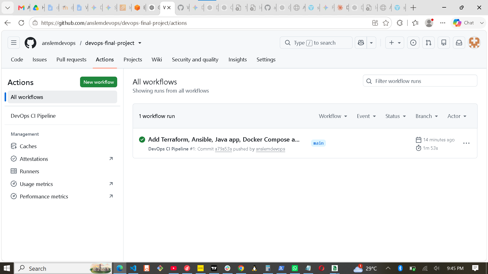


---

## CI/CD Outcome

The implementation of GitHub Actions introduced automation into the project lifecycle. Every future code change pushed to the repository can automatically trigger validation and deployment stages, reducing manual effort and improving reliability.

### Achievements

* Automated Continuous Integration
* GitHub Actions workflow creation
* Automatic build triggering
* Successful pipeline execution
* Version-controlled deployment process
* Foundation for future Continuous Deployment (CD)

---

## Summary

GitHub Actions was successfully integrated into the DevOps project to provide CI/CD capabilities. The pipeline automatically executes whenever code is pushed to GitHub, ensuring consistency, automation, and improved software delivery practices.


## Docker Image Build and Application Deployment

After provisioning infrastructure with Terraform and configuring the server using Ansible, both applications were containerized and deployed using Docker.

### Build Portfolio Application Image


docker build -t portfolio-app ./portfolio


### Build Java Application Image


docker build -t java-app ./apps/java-app


### Verify Images


docker images


### Run Portfolio Container


docker run -d --name portfolio-container -p 5000:5000 portfolio-app


### Run Java Application Container


docker run -d --name java-container -p 8080:8080 java-app


### Verify Running Containers


docker ps


Both containers were successfully deployed and exposed through their respective ports.


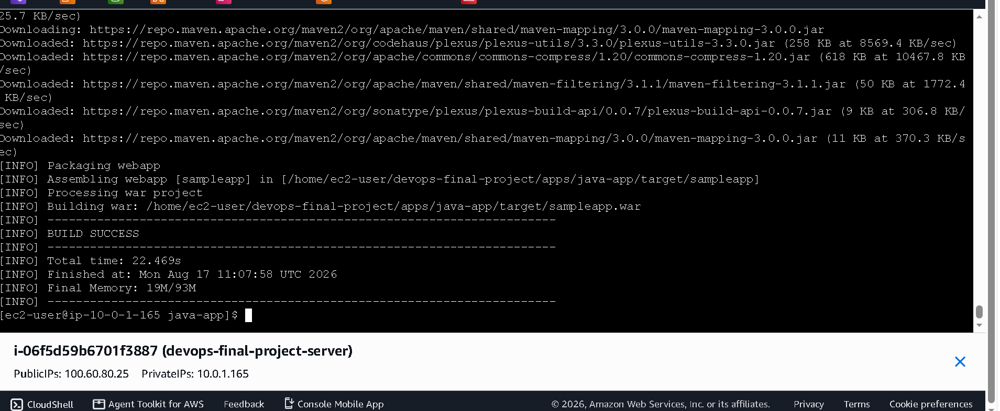

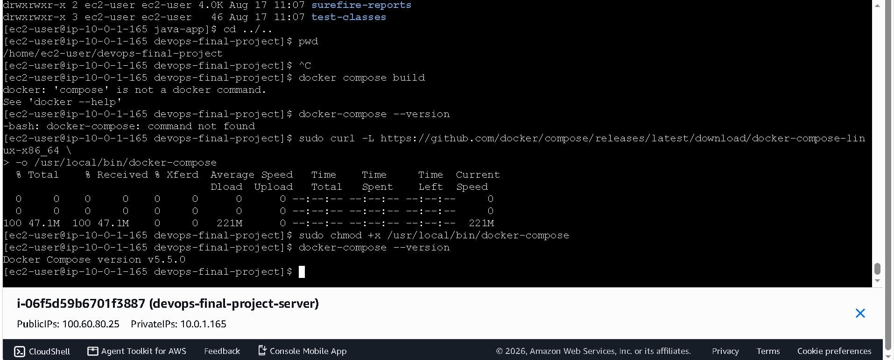

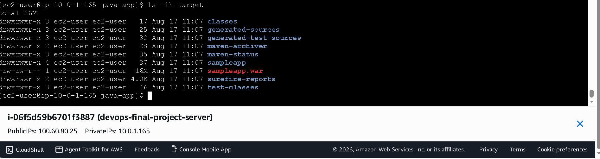

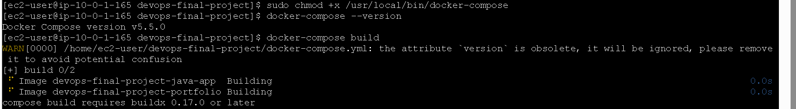

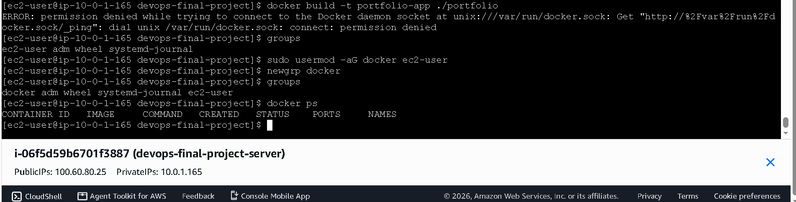

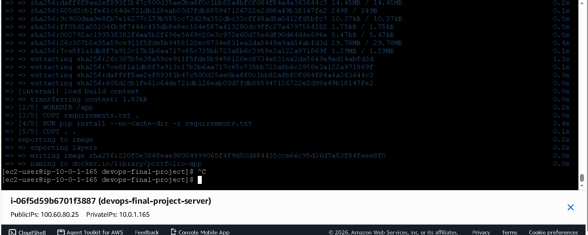

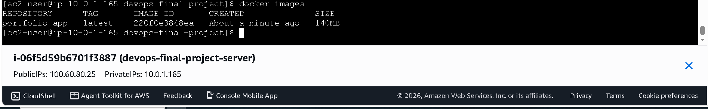

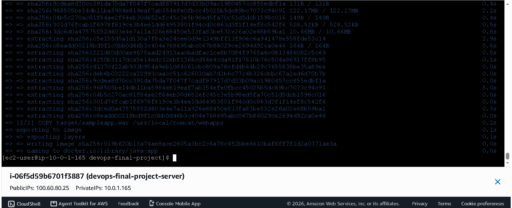

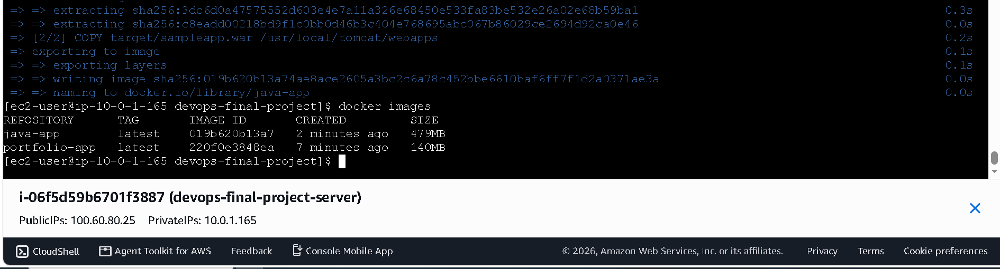

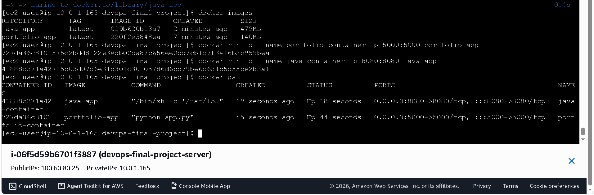

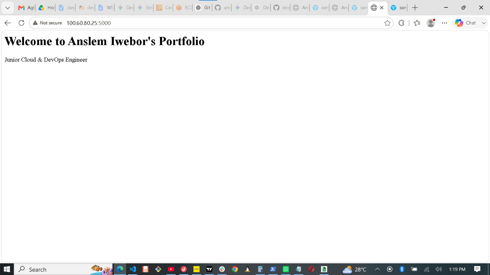

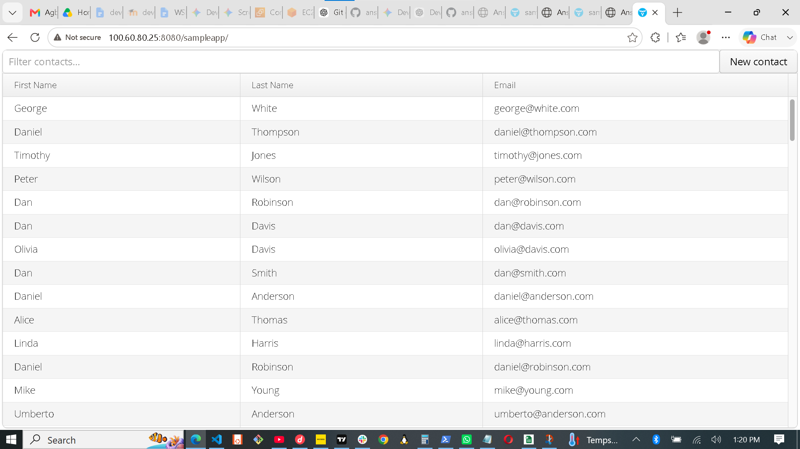


# Project Results and Verification

## Infrastructure Provisioning

Terraform was used to provision AWS infrastructure including:

* VPC
* Public Subnet
* Security Group
* EC2 Instance

Terraform successfully created all required resources.

## Configuration Management

Ansible was used to configure the EC2 server by:

* Installing Docker
* Installing Git
* Starting and enabling Docker service

## Application Containerization

Two applications were containerized using Docker:

### Portfolio Application

A Flask-based portfolio website running on port 5000.

### Java Application

A Java web application packaged as a WAR file and deployed on Tomcat running on port 8080.

## Docker Images

Both application images were successfully built.


docker images


### Screenshot


## Running Containers

Both containers were deployed successfully.


docker ps


## Application Testing

### Portfolio Application

Accessible through:


http://100.60.80.25:5000


### Java Application

Accessible through:


http://100.60.80.25:8080/sampleapp


## CI/CD Pipeline

GitHub Actions was configured to automate application deployment tasks.

The workflow executed successfully after code was pushed to GitHub.

### Screenshot

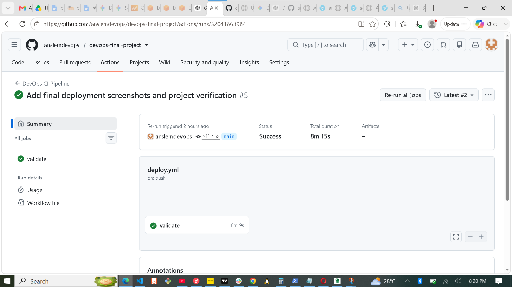


## Project Outcome

The project successfully demonstrates:

* Infrastructure as Code (Terraform)
* Configuration Management (Ansible)
* Containerization (Docker)
* Source Control (GitHub)
* CI/CD Automation (GitHub Actions)
* Cloud Deployment on AWS EC2

All project objectives were completed successfully.


## GitHub Actions CI/CD Verification

The GitHub Actions workflow was executed successfully after code was pushed to the repository.

### Successful Workflow Run


### Validation Performed

- Terraform initialization
- Terraform validation
- Python dependency installation
- CI/CD workflow verification

Result: Successful execution with a green status check.
