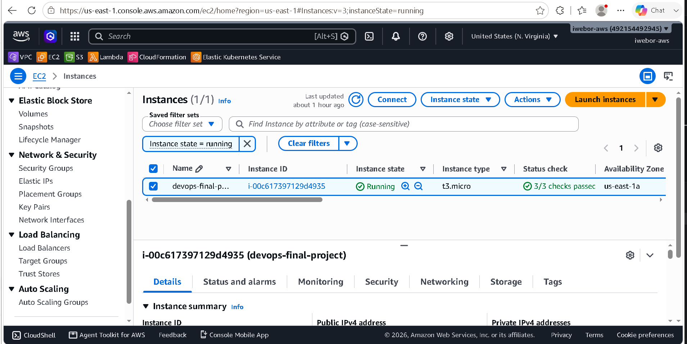
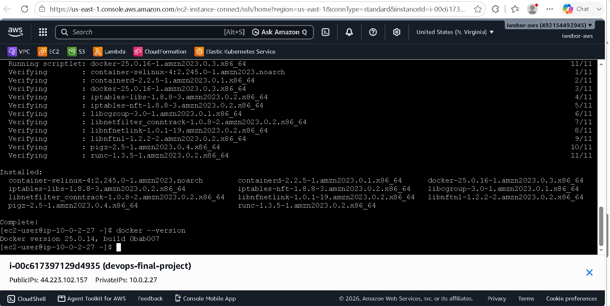
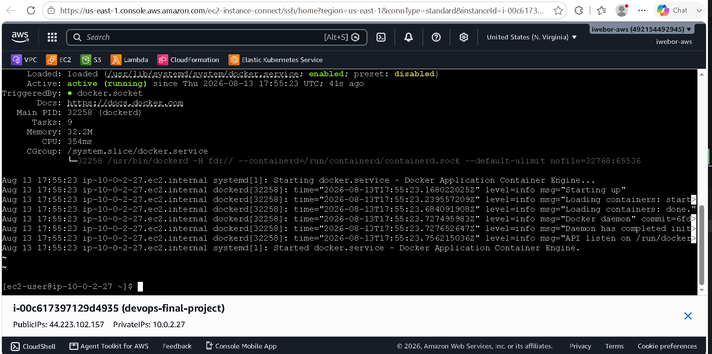
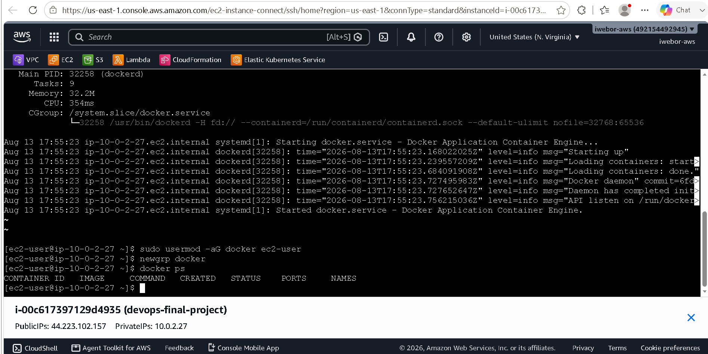
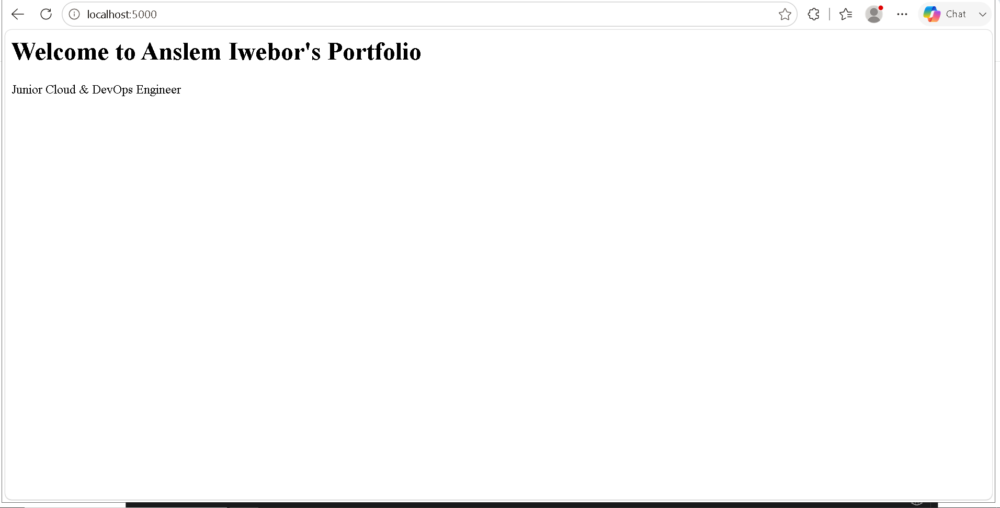
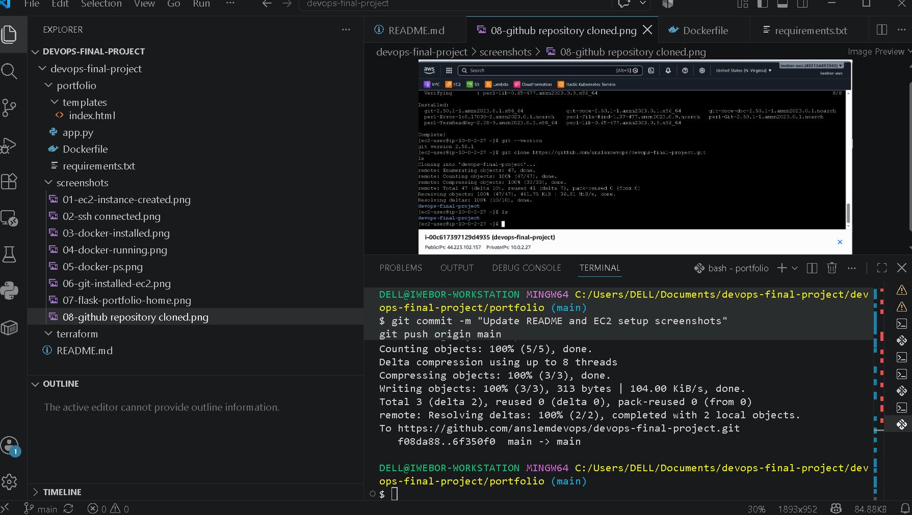

# devops-final-project

# DevOps Final Project

This repository contains a complete end-to-end DevOps project demonstrating:

- Terraform Infrastructure as Code
- Ansible Configuration Management
- Docker Containerization
- GitHub Actions CI/CD
- AWS Deployment

## Project Structure

#PHASE 1 — Prepare GitHub Repository


https://github.com/anslemdevops/devops-final-project


Create this folder structure locally:


devops-final-project/
│
├── apps/
├── terraform/
├── ansible/
├── screenshots/
├── .github/
│   └── workflows/
└── README.md


# PHASE 2:

PHASE 2 — Create EC2 Instance
Step 1: Launch EC2

AWS Console → EC2 → Launch Instance

Use:

Name: devops-final-project-server
AMI: Amazon Linux 2023
Instance Type: t2.micro
Key Pair: Your existing key pair
Security Group

Allow:

SSH     22      My IP
HTTP    80      Anywhere
Custom  5000    Anywhere
Custom  8080    Anywhere

Launch the instance.




# TASK 3

Connect via SSH

## Phase 1: AWS EC2 Provisioning

### Objective

Provision a cloud server to host the portfolio and Java applications.

### EC2 Configuration

| Setting       | Value                       |
| ------------- | --------------------------- |
| Name          | devops-final-project-server |
| OS            | Amazon Linux 2023           |
| Instance Type | t2.micro                    |

### Security Group

* SSH (22)
* HTTP (80)
* Portfolio App (5000)
* Java App (8080)

### Screenshots

#### EC2 Instance Running


#### SSH Connection


SSH connected

# PHASE 2 - install Docker on EC2

## Phase 2: Docker Installation

### Objective

Install Docker on the EC2 instance to host containerized applications.

### Commands Used

```bash
sudo dnf update -y
sudo dnf install docker -y
sudo systemctl start docker
sudo systemctl enable docker
sudo usermod -aG docker ec2-user
newgrp docker
docker ps
```

### Verification

Docker was successfully installed and the Docker service was running.

### Screenshots

#### Docker Installed



#### Docker Service Running



#### Docker Verification




 


# Flask Portfolio Application

## Objective

Replace the plain text Flask response with a professional HTML portfolio page using Flask templates.

## Step 1: Create the HTML Template

Created a template file:

```text
templates/index.html
```

Added the following HTML content:

```html
<!DOCTYPE html>
<html>
<head>
    <title>Anslem Iwebor Portfolio</title>
</head>
<body>
    <h1>Welcome to Anslem Iwebor's Portfolio</h1>
    <p>Junior Cloud & DevOps Engineer</p>

    <h2>Skills</h2>
    <ul>
        <li>AWS</li>
        <li>Docker</li>
        <li>Terraform</li>
        <li>Ansible</li>
        <li>GitHub Actions</li>
    </ul>
</body>
</html>
```

## Step 2: Update Flask Application

Modified `app.py` to render the HTML template.

```python
from flask import Flask, render_template

app = Flask(__name__)

@app.route('/')
def home():
    return render_template('index.html')

if __name__ == '__main__':
    app.run(host='0.0.0.0', port=5000)
```

## Step 3: Run the Application

Started the Flask application:

```bash
python app.py
```

Application output:

```text
* Running on all addresses (0.0.0.0)
* Running on http://127.0.0.1:5000
```

## Step 4: Verify the Application

Opened the application in a browser:

```text
http://localhost:5000
```

The portfolio page was displayed successfully.

## Screenshot




## Installing Git on the EC2 Instance

Git was installed on the Amazon Linux 2023 EC2 instance to enable cloning and managing the project repository directly on the server.

### Install Git


sudo dnf install git -y


### Verify Installation


git --version


### Output

```text id="e1rzxb"
git version <your-version>
```

### Screenshot


## Cloning the GitHub Repository

The project repository was cloned from GitHub onto the EC2 instance.

### Clone Repository


git clone https://github.com/anslemdevops/devops-final-project.git

### Verify Repository

ls


### Screenshot





# Pushing Changes to GitHub

